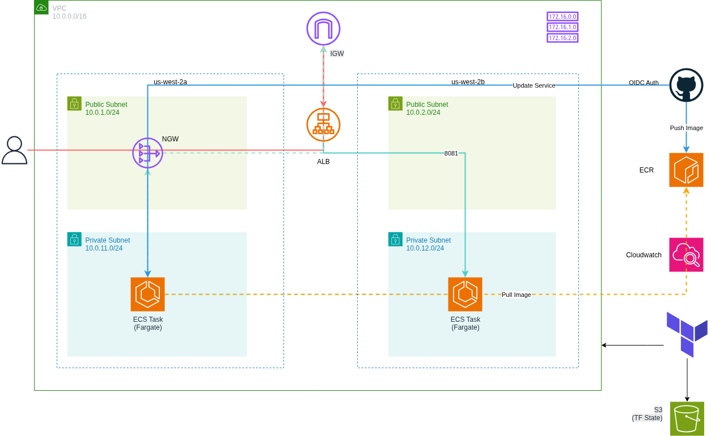

# ECS-NodeJS-Deployment-with-GithubActions-using-Terraform
Production-ready infrastructure for deploying containerized Node.js applications on AWS ECS Fargate with automated CI/CD using GitHub Actions and OIDC authentication.

## Architecture Overview

This project provisions a secure, highly available AWS infrastructure with:

- **Multi-AZ VPC** spanning 2 availability zones
- **Application Load Balancer** for traffic distribution
- **ECS Fargate** for serverless container orchestration
- **ECR** for container image storage
- **GitHub OIDC** for keyless CI/CD authentication
- **CloudWatch Logs** for centralized logging
- **Terraform** for infrastructure as code

## Prerequisites

- Active AWS account with relevant access
- AWS CLI configured with credentials
- S3 bucket for Terraform state backend
- ECR repository created manually
- Initial Docker image built and pushed to ECR
- Image URI available for Terraform configuration

## Project Structure

```
terraform-ecs-infra/
├── modules/
│   ├── vpc/              # Network infrastructure
│   ├── security/         # Security groups
│   ├── alb/             # Application Load Balancer
│   ├── iam/             # IAM roles (OIDC, ECS)
│   └── ecs/             # ECS cluster and service
└── root/
    ├── main.tf          # Root module
    ├── variables.tf     # Variable definitions
    ├── outputs.tf       # Output values
    └── terraform.tfvars # Variable values
```

### Deploy Infrastructure

```bash
cd root/
terraform init
terraform validate
terraform plan
terraform apply
```

### Deploy Application

Push code to the `main` branch - GitHub Actions will automatically:
1. Build Docker image
2. Push to ECR
3. Update ECS service
4. Roll out new tasks

### Access Application

After deployment, access your application at the ALB DNS:

```bash
terraform output alb_dns_name
```

Example: `http://wu-node-app-alb-1234567890.us-west-2.elb.amazonaws.com`


## Security Features

- **Private Subnets**: ECS tasks run in private subnets with no direct internet access
- **Security Groups**: Strict ingress/egress rules following least privilege
- **OIDC Authentication**: No long-lived AWS credentials stored in GitHub
- **IAM Roles**: Separate roles for task execution and application runtime
- **Network Isolation**: ALB is the only entry point to ECS tasks

## Infrastructure Components

### VPC Module
- Custom VPC with configurable CIDR
- 2 Availability Zones for high availability
- Public subnets for ALB
- Private subnets for ECS tasks
- Single NAT Gateway (cost optimization)
- Internet Gateway for public access

### Security Module
- ALB Security Group: Allows HTTP (port 80) from internet
- ECS Security Group: Only accepts traffic from ALB on port 8081

### ALB Module
- Internet-facing Application Load Balancer
- IP-based target group for Fargate
- Health checks on application endpoint
- HTTP listener forwarding to targets

### IAM Module
Three distinct roles:
1. **GitHub Actions Role**: OIDC-based, allows ECR push and ECS updates
2. **Task Execution Role**: Pulls images and writes logs
3. **Task Role**: Application runtime permissions

### ECS Module
- Fargate-only cluster (no EC2 management)
- Task definition with configurable CPU/memory
- Service with 2 tasks across AZs
- CloudWatch Logs integration

## 🔄 CI/CD Pipeline

The GitHub Actions workflow automates deployment:

1. **Checkout**: Clone repository code
2. **AWS Auth**: Authenticate via OIDC (no stored keys)
3. **ECR Login**: Authenticate Docker with ECR
4. **Build & Push**: Build image with commit SHA tag
5. **Download Task Def**: Fetch current task definition
6. **Clean Task Def**: Remove AWS-managed fields
7. **Update Image**: Inject new image URI
8. **Deploy**: Register new task def and update service

## 📊 Monitoring & Logging

### CloudWatch Logs
All container logs are sent to CloudWatch:
- Log Group: `/ecs/wu-node-app`
- Retention: 7 days
- Stream prefix: `ecs`

### Health Checks
ALB performs health checks:
- Path: `/`
- Interval: 30 seconds
- Healthy threshold: 2 checks
- Unhealthy threshold: 3 checks

## 🔄 Cleanup

To destroy all infrastructure:

```bash
cd root/
terraform destroy
```

**Note**: Manually delete the ECR repository if it contains images.

